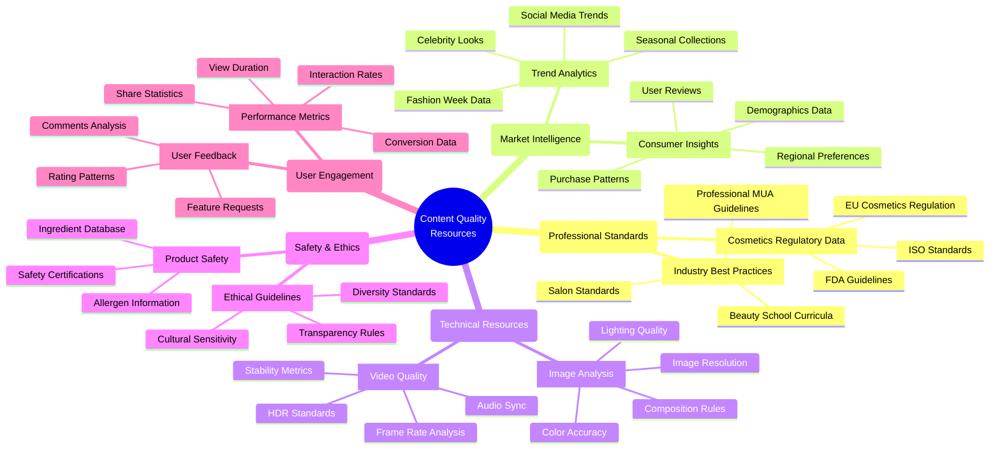
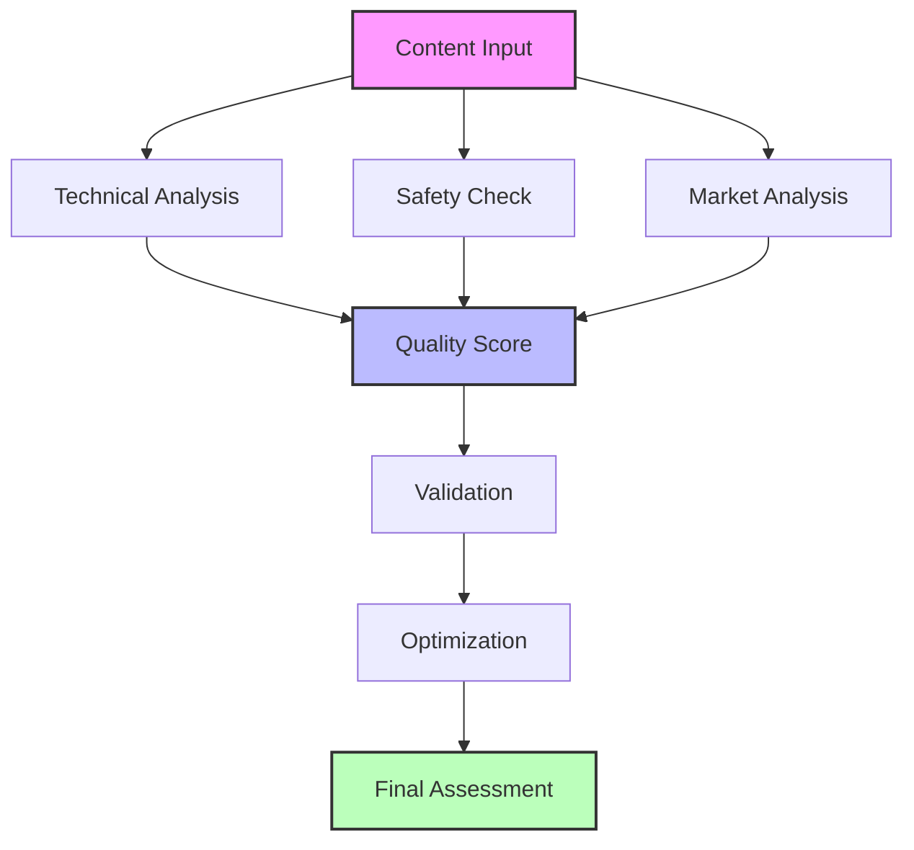

# AI Content Resources and Quality Assessment

## Data Sources Overview



## Primary Data Sources

### 1. Professional Beauty Standards
- **Cosmetics Regulatory Bodies**
  ```typescript
  interface RegulatorySource {
    name: string;
    region: string;
    guidelines: Guideline[];
    lastUpdated: Date;
    validationRules: ValidationRule[];
  }
  ```
  - FDA Cosmetics Guidelines
  - EU Cosmetics Regulation
  - ISO Beauty Standards
  - Regional Certification Bodies

- **Industry Organizations**
  ```typescript
  interface IndustryResource {
    organization: string;
    standards: Standard[];
    bestPractices: BestPractice[];
    certifications: Certification[];
  }
  ```
  - Professional Beauty Association
  - International Beauty Standards Board
  - Cosmetic Executive Women
  - Global Beauty Alliance

### 2. Technical Quality Assessment

- **Image Analysis APIs**
  ```typescript
  interface ImageQualityMetrics {
    resolution: Resolution;
    colorAccuracy: ColorMetrics;
    lighting: LightingQuality;
    composition: CompositionScore;
    clarity: number;
  }
  ```
  - Google Cloud Vision AI
  - Azure Computer Vision
  - AWS Rekognition
  - Custom Beauty-Specific CV Models

- **Video Quality Standards**
  ```typescript
  interface VideoQualityMetrics {
    frameRate: number;
    resolution: Resolution;
    stability: number;
    audioSync: number;
    compressionQuality: number;
  }
  ```
  - Streaming Media Standards
  - Professional Video Guidelines
  - Platform-Specific Requirements

### 3. Market Intelligence

- **Trend Analysis Sources**
  ```typescript
  interface TrendSource {
    platform: string;
    dataPoints: TrendDataPoint[];
    updateFrequency: string;
    reliability: number;
  }
  ```
  - Social Media Platforms
    - Instagram Beauty Trends
    - TikTok Viral Looks
    - Pinterest Trending Boards
  - Fashion Industry Data
    - Runway Reports
    - Celebrity Stylist Insights
    - Fashion Week Analytics

- **Consumer Research**
  ```typescript
  interface ConsumerInsight {
    demographic: Demographic;
    preferences: Preference[];
    behaviors: Behavior[];
    trends: Trend[];
  }
  ```
  - Market Research Reports
  - Beauty Industry Analytics
  - Consumer Behavior Studies
  - Sales Pattern Analysis

### 4. Safety and Ethics Resources

- **Product Safety Database**
  ```typescript
  interface SafetyDatabase {
    ingredients: Ingredient[];
    allergens: Allergen[];
    restrictions: Restriction[];
    certifications: Certification[];
  }
  ```
  - CosIng Database
  - EWG Skin Deep
  - INCI Dictionary
  - Safety Assessment Reports

- **Ethical Guidelines**
  ```typescript
  interface EthicalStandard {
    category: string;
    requirements: Requirement[];
    compliance: ComplianceRule[];
    validation: ValidationMethod[];
  }
  ```
  - Diversity Standards
  - Cultural Sensitivity Guidelines
  - Transparency Requirements
  - Ethical Marketing Rules

## Implementation Strategy

### 1. Data Integration

```typescript
class ContentResourceManager {
  private static instance: ContentResourceManager;
  private dataSources: Map<string, DataSource>;
  
  async fetchQualityMetrics(content: Content): Promise<QualityMetrics> {
    const technical = await this.getTechnicalQuality(content);
    const safety = await this.getSafetyCompliance(content);
    const market = await this.getMarketRelevance(content);
    
    return this.combineMetrics(technical, safety, market);
  }
  
  async validateContent(content: Content): Promise<ValidationResult> {
    const regulatory = await this.checkRegulatoryCommunication(content);
    const technical = await this.validateTechnicalRequirements(content);
    const ethical = await this.validateEthicalStandards(content);
    
    return this.generateValidationReport(regulatory, technical, ethical);
  }
}
```

### 2. Quality Assessment Pipeline



### 3. Update Frequency

| Resource Type | Update Frequency | Validation Period |
|--------------|------------------|-------------------|
| Regulatory Data | Monthly | 6 Months |
| Technical Standards | Quarterly | 3 Months |
| Market Trends | Daily | 24 Hours |
| Safety Data | Weekly | 1 Month |
| User Feedback | Real-time | Continuous |

### 4. Resource Access Pattern

```typescript
class ResourceAccessManager {
  private cache: Cache;
  private rateLimiter: RateLimiter;
  
  async getResource(type: ResourceType): Promise<Resource> {
    if (this.cache.has(type)) {
      return this.cache.get(type);
    }
    
    await this.rateLimiter.acquire();
    const resource = await this.fetchResource(type);
    this.cache.set(type, resource);
    
    return resource;
  }
  
  private async fetchResource(type: ResourceType): Promise<Resource> {
    switch (type) {
      case ResourceType.REGULATORY:
        return await this.fetchRegulatoryData();
      case ResourceType.TECHNICAL:
        return await this.fetchTechnicalStandards();
      case ResourceType.MARKET:
        return await this.fetchMarketData();
      // ...
    }
  }
}
```

## Best Practices

1. **Data Freshness**
   - Implement TTL for cached resources
   - Regular validation of data sources
   - Version tracking for standards

2. **Resource Optimization**
   - Implement efficient caching strategies
   - Use rate limiting for external APIs
   - Batch processing for bulk operations

3. **Quality Assurance**
   - Regular audits of data sources
   - Validation of resource integrity
   - Performance monitoring of integrations

4. **Compliance**
   - Track regulatory changes
   - Document data usage
   - Maintain audit trails

## Future Enhancements

1. **AI Model Training**
   - Custom beauty-specific models
   - Trend prediction algorithms
   - Quality assessment neural networks

2. **Data Sources**
   - Integration with new platforms
   - Enhanced real-time analytics
   - Expanded regional coverage

3. **Quality Metrics**
   - Advanced image analysis
   - Enhanced video processing
   - Improved trend detection
