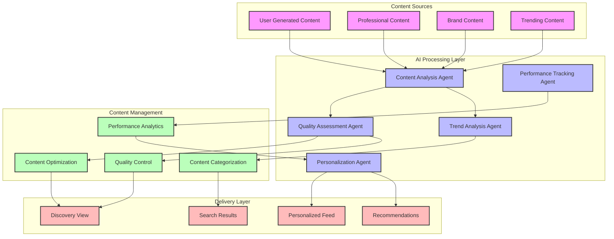
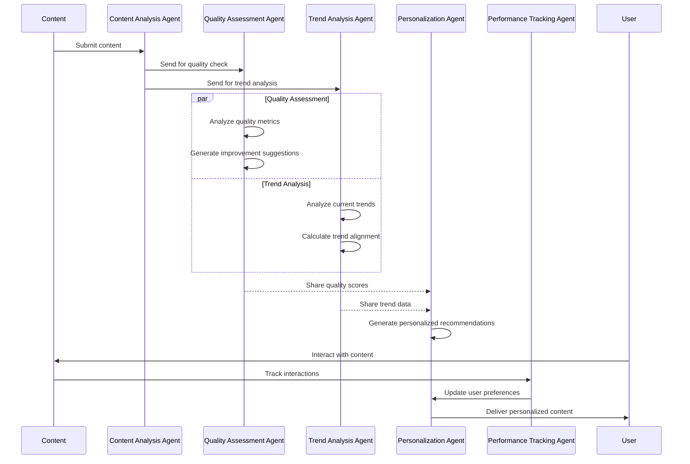
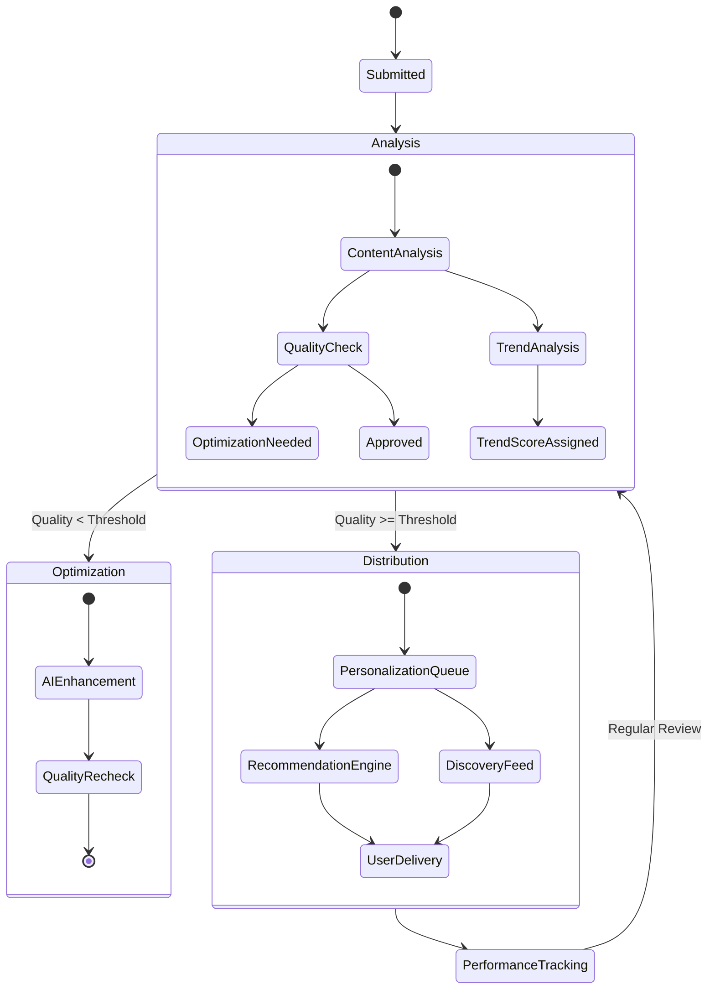
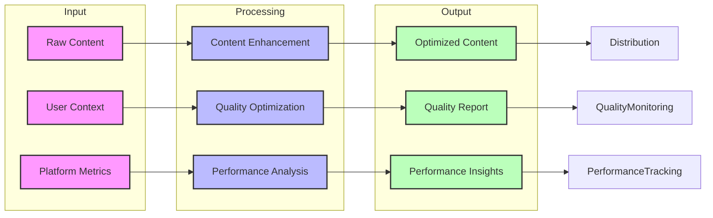

# AI Flow Architecture

## Content Flow Overview

## AI Agents Interaction Flow

## Content Processing States

## AI Agent Responsibilities

### Content Analysis Agent (CAA)
- Initial content processing
- Feature extraction
- Content classification
- Metadata enrichment

### Quality Assessment Agent (QAA)
- Technical quality evaluation
- Content accuracy verification
- Brand safety checks
- Improvement recommendations

### Trend Analysis Agent (TAA)
- Real-time trend monitoring
- Trend prediction
- Content relevance scoring
- Seasonal analysis

### Personalization Agent (PA)
- User preference learning
- Content matching
- Recommendation generation
- Feed customization

### Performance Tracking Agent (PTA)
- Engagement monitoring
- Conversion tracking
- A/B testing
- Analytics reporting

## Content Optimization Flow

## Implementation Notes

1. **Agent Communication**
   - Agents communicate through a message queue system
   - Each agent maintains its own state cache
   - Results are shared through a centralized data store

2. **Optimization Process**
   - Content is optimized in real-time when possible
   - Batch processing for large content sets
   - Continuous learning from performance metrics

3. **Quality Thresholds**
   - Dynamic thresholds based on content type
   - Automatic adjustment based on user engagement
   - Regular calibration using performance data

4. **Performance Monitoring**
   - Real-time monitoring of agent performance
   - Automatic scaling based on load
   - Error recovery and fallback mechanisms
