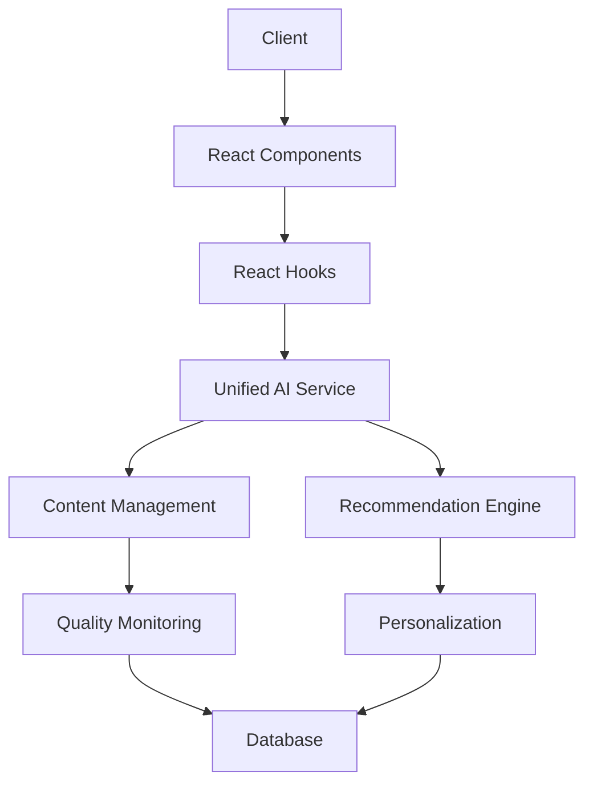

# AI Implementation Guide

## Technical Architecture

### System Overview



## Core Services

### UnifiedAIService

The UnifiedAIService is implemented as a singleton that coordinates all AI agents and services.

```typescript
class UnifiedAIService {
  private static instance: UnifiedAIService;
  private contentAgent: ContentAgent;
  private searchAgent: SearchAgent;
  private performanceMonitor: PerformanceMonitor;
  
  // Get singleton instance
  static getInstance(): UnifiedAIService;
  
  // Set user preferences
  setUserContext(preferences: UserPreferences): void;
  
  // Search with AI ranking
  async search(
    query: string,
    filters?: Record<string, any>
  ): Promise<SearchResult[]>;
  
  // Get products with caching
  async getProducts(
    category?: string
  ): Promise<Product[]>;
  
  // Get trending looks
  async getTrendingLooks(): Promise<Look[]>;
  
  // Analyze and curate content
  async curateContent(
    content: Content
  ): Promise<CurationResult>;
  
  // Get performance metrics
  getPerformanceMetrics(): PerformanceMetrics;
}
```

### AI Agents

#### ContentAgent

Handles content management, quality analysis, and trend detection:

```typescript
class ContentAgent {
  // Analyze content quality
  async analyzeContentQuality(
    content: Content
  ): Promise<ContentQualityMetrics>;
  
  // Analyze content trends
  async analyzeTrends(
    contents: Content[]
  ): Promise<TrendAnalysis>;
  
  // Curate content
  async curateContent(
    content: Content
  ): Promise<CurationResult>;
}
```

#### SearchAgent

Provides AI-powered search with multi-factor ranking:

```typescript
class SearchAgent {
  // Search with ranking
  async search(
    query: string,
    filters?: Record<string, any>
  ): Promise<SearchResult[]>;
  
  // Calculate ranking factors
  private calculateRankingFactors(
    query: string,
    content: Content,
    filters: Record<string, any>
  ): Promise<SearchRankingFactors>;
}
```

### Performance Monitoring

The PerformanceMonitor tracks system metrics:

```typescript
class PerformanceMonitor {
  // Record metrics
  recordContentQuality(score: number): void;
  recordRecommendationAccuracy(score: number): void;
  recordProcessingTime(milliseconds: number): void;
  recordCacheHit(): void;
  recordCacheMiss(): void;
  recordError(): void;
  
  // Get metrics
  getMetrics(): PerformanceMetrics;
  
  // Measure operation time
  async measureOperationTime<T>(
    operation: () => Promise<T>
  ): Promise<T>;
}
```

## React Integration

### Hooks

#### useUnifiedRecommendations

```typescript
function useUnifiedRecommendations({
  userPreferences,
  recentlyViewed,
  purchaseHistory,
}: UseUnifiedRecommendationsProps) {
  // Set up user context
  useEffect(() => {
    unifiedAIService.setUserContext(
      userPreferences,
      purchaseHistory,
      recentlyViewed
    );
  }, [userPreferences, purchaseHistory, recentlyViewed]);

  // Get personalized recommendations
  const { data: personalizedData } = useQuery({
    queryKey: ['personalized-recommendations', userPreferences],
    queryFn: () => unifiedAIService.getPersonalizedRecommendations(recentlyViewed),
    staleTime: 1000 * 60 * 30, // 30 minutes
  });

  // Additional queries...
}
```

### Components

#### ProductRecommendations

```typescript
const ProductRecommendations: React.FC<ProductRecommendationsProps> = ({
  userPreferences,
  recentlyViewed,
  purchaseHistory,
}) => {
  const {
    personalizedRecommendations,
    trendingProducts,
    similarProducts,
    qualityScores,
    insights,
    isLoading,
    error,
  } = useUnifiedRecommendations({
    userPreferences,
    recentlyViewed,
    purchaseHistory,
  });

  // Component implementation...
};
```

#### DiscoveryView

```typescript
const DiscoveryView = () => {
  // Fetch looks with AI-powered curation
  const { data: looksData } = useQuery({
    queryKey: ['curated-looks', selectedCategory],
    queryFn: async () => {
      const looks = await fetchLooks(selectedCategory);
      const curatedLooks = await contentManager.batchOptimizeContent(looks);
      return curatedLooks;
    },
    staleTime: 1000 * 60 * 5, // 5 minutes
  });

  // Component implementation...
};
```

## Performance Optimization

### Caching Strategy

1. **React Query Configuration**
```typescript
const queryClient = new QueryClient({
  defaultOptions: {
    queries: {
      staleTime: 1000 * 60 * 5, // 5 minutes
      cacheTime: 1000 * 60 * 30, // 30 minutes
      retry: 3,
      retryDelay: (attemptIndex) => Math.min(1000 * 2 ** attemptIndex, 30000),
    },
  },
});
```

2. **Batch Processing**
```typescript
// Batch process content items
const batchSize = 20;
const batches = chunk(contents, batchSize);
const results = await Promise.all(
  batches.map(batch => contentManager.batchOptimizeContent(batch))
);
```

### Error Handling

```typescript
try {
  const result = await unifiedAIService.curateContent(content);
  return result;
} catch (error) {
  if (error instanceof AIServiceError) {
    // Handle AI service specific errors
    logger.error('AI Service Error:', error);
    return fallbackContent(content);
  }
  
  // Handle other errors
  logger.error('Unexpected Error:', error);
  throw error;
}
```

## Testing

### Unit Tests

```typescript
describe('UnifiedAIService', () => {
  beforeEach(() => {
    // Reset singleton instance
    UnifiedAIService['instance'] = null;
  });

  it('should maintain singleton instance', () => {
    const instance1 = UnifiedAIService.getInstance();
    const instance2 = UnifiedAIService.getInstance();
    expect(instance1).toBe(instance2);
  });

  it('should generate personalized recommendations', async () => {
    const service = UnifiedAIService.getInstance();
    const recommendations = await service.getPersonalizedRecommendations(products);
    expect(recommendations).toHaveLength(10);
    expect(recommendations[0]).toHaveProperty('score');
  });
});
```

### Integration Tests

```typescript
describe('Content Management Integration', () => {
  it('should optimize content and update quality metrics', async () => {
    const content = createMockContent();
    const optimizedContent = await contentManager.optimizeContent(content);
    const qualityReport = await contentManager.getContentQualityReport(optimizedContent);
    
    expect(qualityReport.qualityScore).toBeGreaterThan(0.7);
    expect(qualityReport.recommendations).toHaveLength(3);
  });
});
```

## Monitoring and Logging

### Performance Monitoring

```typescript
class AIPerformanceMonitor {
  private metrics: {
    latency: number[];
    successRate: number;
    totalRequests: number;
  };

  logRequest(startTime: number, success: boolean) {
    const latency = Date.now() - startTime;
    this.metrics.latency.push(latency);
    this.metrics.totalRequests++;
    if (success) {
      this.metrics.successRate = 
        (this.metrics.successRate * (this.metrics.totalRequests - 1) + 1) /
        this.metrics.totalRequests;
    }
  }
}
```

### Error Logging

```typescript
class AILogger {
  logError(error: Error, context: any) {
    console.error('AI Service Error:', {
      error: error.message,
      stack: error.stack,
      context,
      timestamp: new Date().toISOString(),
    });
  }
}
```

## Deployment Considerations

1. **Scaling**
   - Use horizontal scaling for AI services
   - Implement request queuing for batch operations
   - Cache frequently accessed results

2. **Monitoring**
   - Track API usage and latency
   - Monitor quality metrics over time
   - Set up alerts for quality degradation

3. **Updates**
   - Use feature flags for gradual rollouts
   - Maintain backward compatibility
   - Document all API changes
