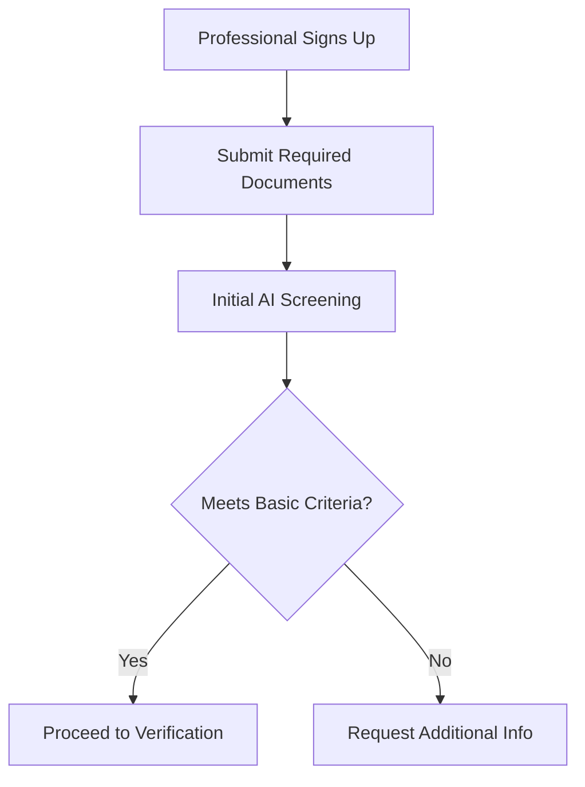

# Professional Verification Process

## Overview
Comprehensive verification system for makeup professionals ensuring quality, authenticity, and safety for our platform users.

## Verification Workflow

### 1. Initial Application


#### Required Documentation
1. Professional Identity
   - Government-issued ID
   - Professional headshot
   - Business registration (if applicable)
   - Insurance documentation

2. Credentials
   - Makeup artistry certifications
   - Training certificates
   - Specialized course completions
   - Professional memberships

3. Portfolio Requirements
   - Minimum 10 professional works
   - Before/after photographs
   - Different makeup styles
   - Various client demographics

4. Professional References
   - 3 industry references
   - Previous client testimonials
   - Professional collaboration proof
   - Industry recognition

### 2. AI-Powered Verification

#### Document Analysis
```python
class DocumentVerification:
    def verify_documents(self):
        return {
            'identity_check': self.verify_id_authenticity(),
            'credential_validation': self.verify_credentials(),
            'insurance_status': self.verify_insurance(),
            'business_status': self.verify_business_registration()
        }
```

#### Portfolio Analysis
1. Image Quality Metrics
   - Resolution: Minimum 1920x1080
   - Lighting: Professional standard
   - Clarity: High definition
   - Color accuracy: Calibrated

2. Technique Assessment
   - Application precision
   - Color theory implementation
   - Blending quality
   - Symmetry analysis

3. Style Diversity
   - Minimum 5 distinct styles
   - Various skin tones
   - Different age groups
   - Multiple occasions

### 3. Background Verification

#### Professional History
1. Experience Validation
   - Work history verification
   - Employment records
   - Freelance portfolio
   - Client history

2. Education Verification
   - Institution accreditation
   - Course completion
   - Specialized training
   - Continuing education

3. Reference Checks
   - Professional references
   - Industry connections
   - Client testimonials
   - Peer reviews

### 4. Social Media Verification

#### Platform Analysis
1. Instagram
   - Minimum 1,000 followers
   - Regular posting schedule
   - Professional content
   - Engagement metrics

2. YouTube (if applicable)
   - Tutorial quality
   - Subscriber count
   - Content consistency
   - Engagement rates

3. Professional Websites
   - Portfolio quality
   - Service descriptions
   - Client testimonials
   - Booking systems

### 5. Skill Assessment

#### Technical Evaluation
1. Core Skills
   - Color matching
   - Product knowledge
   - Application techniques
   - Sanitation practices

2. Specialized Skills
   - Special effects
   - Bridal makeup
   - Editorial work
   - Age-appropriate techniques

3. Safety & Hygiene
   - Product safety
   - Tool sanitization
   - Allergies awareness
   - Emergency procedures

### 6. Verification Scoring

#### Scoring Matrix
```python
class VerificationScore:
    def calculate_score(self):
        weights = {
            'credentials': 0.25,
            'portfolio': 0.30,
            'experience': 0.20,
            'social_presence': 0.15,
            'client_reviews': 0.10
        }
        return self.weighted_average(scores, weights)
```

#### Minimum Requirements
- Overall score: 80%+
- No category below 70%
- Clean background check
- Valid credentials
- Complete portfolio

### 7. Ongoing Monitoring

#### Quality Assurance
1. Regular Reviews
   - Quarterly portfolio updates
   - Client feedback analysis
   - Skill assessment updates
   - Credential renewals

2. Performance Metrics
   - Client satisfaction
   - Booking rate
   - Review scores
   - Issue resolution

3. Compliance Checks
   - Insurance status
   - Credential validity
   - Safety compliance
   - Professional development

### 8. Verification Renewal

#### Annual Review Process
1. Documentation Update
   - Current credentials
   - Insurance renewal
   - Portfolio additions
   - Professional development

2. Performance Review
   - Client feedback
   - Platform metrics
   - Professional growth
   - Community contribution

## Professional Tiers

### Tier Classification
1. Verified Professional
   - Basic verification
   - Standard features
   - Regular listing
   - Basic analytics

2. Premium Professional
   - Advanced verification
   - Priority listing
   - Enhanced features
   - Detailed analytics

3. Elite Professional
   - Expert verification
   - Featured placement
   - Full platform access
   - Advanced analytics

### Tier Benefits
```python
class ProfessionalTiers:
    def get_tier_benefits(self, tier):
        benefits = {
            'verified': {
                'listing_priority': 'standard',
                'feature_access': 'basic',
                'analytics': 'basic',
                'support': '24/7'
            },
            'premium': {
                'listing_priority': 'enhanced',
                'feature_access': 'advanced',
                'analytics': 'detailed',
                'support': 'priority'
            },
            'elite': {
                'listing_priority': 'top',
                'feature_access': 'full',
                'analytics': 'advanced',
                'support': 'dedicated'
            }
        }
        return benefits[tier]
```

## Verification Technology Stack

### AI Components
1. Document Analysis
   - OCR processing
   - Fraud detection
   - Data validation
   - Information extraction

2. Image Analysis
   - Quality assessment
   - Style classification
   - Technique validation
   - Before/after comparison

3. Social Media Analysis
   - Profile verification
   - Engagement analysis
   - Content assessment
   - Network validation

### Security Measures
1. Data Protection
   - End-to-end encryption
   - Secure storage
   - Access control
   - Audit logging

2. Privacy Controls
   - Data minimization
   - Consent management
   - Information rights
   - Data retention

### Integration Points
1. Main Platform
   - User profiles
   - Booking system
   - Review system
   - Analytics dashboard

2. External Services
   - Background checks
   - Credential verification
   - Insurance validation
   - Social media APIs

## Support Systems

### Professional Support
1. Verification Assistance
   - Document guidance
   - Portfolio review
   - Technical support
   - Appeal process

2. Ongoing Support
   - Account management
   - Feature training
   - Issue resolution
   - Professional development

### Client Protection
1. Safety Measures
   - Identity verification
   - Insurance coverage
   - Complaint system
   - Dispute resolution

2. Quality Assurance
   - Service standards
   - Safety protocols
   - Review validation
   - Issue escalation

## Reporting and Analytics

### Professional Metrics
1. Performance Tracking
   - Booking rates
   - Client satisfaction
   - Review scores
   - Response times

2. Quality Metrics
   - Portfolio updates
   - Skill development
   - Safety compliance
   - Professional growth

### Platform Metrics
1. Verification Statistics
   - Approval rates
   - Processing times
   - Issue frequency
   - Resolution rates

2. System Performance
   - AI accuracy
   - Process efficiency
   - Support effectiveness
   - User satisfaction
