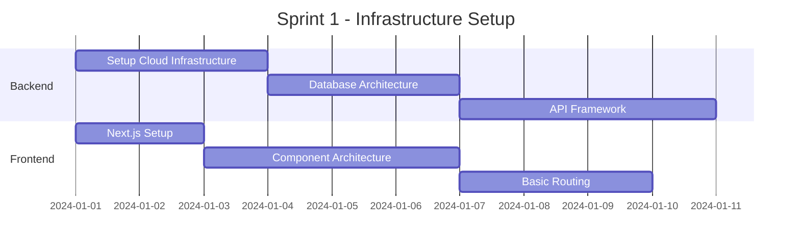
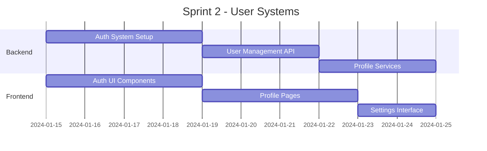
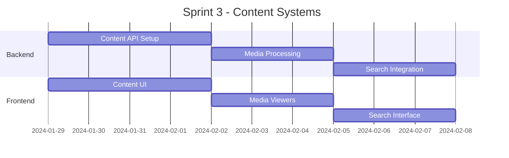

# Technical Implementation Schedule

## Overview
Detailed implementation timeline with sprints, milestones, and deliverables for the Makeup Discovery Platform.

## Phase 1: Foundation (Months 1-3)

### Sprint 1: Core Infrastructure (Weeks 1-2)


#### Deliverables
1. Cloud Infrastructure
   - AWS/GCP setup
   - Docker containers
   - Kubernetes clusters
   - CI/CD pipelines

2. Database Architecture
   - PostgreSQL setup
   - Redis caching
   - MongoDB for content
   - Elasticsearch configuration

3. Frontend Foundation
   - Next.js 14 setup
   - TypeScript configuration
   - Tailwind CSS integration
   - Component library

### Sprint 2: Authentication & User Management (Weeks 3-4)


#### Deliverables
1. Authentication System
   - OAuth integration
   - JWT implementation
   - Role-based access
   - Session management

2. User Management
   - Profile CRUD
   - Preferences system
   - Settings management
   - Privacy controls

### Sprint 3: Content Management (Weeks 5-6)


## Phase 2: Core Features (Months 4-6)

### Sprint 4: AI Integration (Weeks 7-8)
```python
class AIImplementationPlan:
    def setup_ai_pipeline(self):
        return {
            'content_analysis': self.setup_content_analysis(),
            'recommendation_engine': self.setup_recommendations(),
            'trend_analysis': self.setup_trend_analysis(),
            'personalization': self.setup_personalization()
        }
```

#### Deliverables
1. Content Analysis System
   - Image recognition
   - Video processing
   - Text analysis
   - Quality scoring

2. Recommendation Engine
   - Collaborative filtering
   - Content-based filtering
   - Hybrid recommendations
   - A/B testing framework

### Sprint 5: AR Features (Weeks 9-10)
```typescript
interface ARImplementation {
    virtualTryOn: {
        faceMapping: boolean;
        productSimulation: boolean;
        realTimeRendering: boolean;
    };
    features: {
        makeupSimulation: boolean;
        colorMatching: boolean;
        textureAnalysis: boolean;
    };
}
```

#### Deliverables
1. AR Core
   - Face detection
   - 3D rendering
   - Product mapping
   - Real-time processing

2. Virtual Try-On
   - Makeup simulation
   - Color matching
   - Texture analysis
   - Look saving

### Sprint 6: Social Integration (Weeks 11-12)
```python
class SocialIntegration:
    def setup_social_features(self):
        platforms = {
            'instagram': self.setup_instagram_integration(),
            'tiktok': self.setup_tiktok_integration(),
            'youtube': self.setup_youtube_integration(),
            'pinterest': self.setup_pinterest_integration()
        }
        return platforms
```

## Phase 3: Professional Features (Months 7-9)

### Sprint 7: Professional Profiles (Weeks 13-14)
#### Deliverables
1. Profile Management
   - Portfolio system
   - Booking interface
   - Review system
   - Analytics dashboard

2. Verification System
   - Document verification
   - Background checks
   - Skills validation
   - Rating system

### Sprint 8: E-commerce Integration (Weeks 15-16)
```typescript
interface EcommerceSystem {
    payment: {
        processing: string[];
        security: string[];
        reconciliation: string[];
    };
    inventory: {
        tracking: boolean;
        alerts: boolean;
        analytics: boolean;
    };
}
```

## Phase 4: Advanced Features (Months 10-12)

### Sprint 9: AI Enhancements (Weeks 17-18)
#### Deliverables
1. Advanced AI
   - Trend prediction
   - Style analysis
   - Personalization
   - Content curation

2. Machine Learning
   - Model training
   - Feature extraction
   - Performance optimization
   - Accuracy improvements

### Sprint 10: Performance Optimization (Weeks 19-20)
```python
class PerformanceOptimization:
    def optimize_systems(self):
        return {
            'caching': self.setup_caching_layers(),
            'cdn': self.configure_cdn(),
            'database': self.optimize_queries(),
            'api': self.implement_graphql()
        }
```

## Milestone Schedule

### Month 1-3 Milestones
- [ ] Infrastructure setup complete
- [ ] User authentication system live
- [ ] Basic content management operational
- [ ] Initial AI integration functional

### Month 4-6 Milestones
- [ ] AR features implemented
- [ ] Social integration complete
- [ ] Professional profiles live
- [ ] E-commerce foundation ready

### Month 7-9 Milestones
- [ ] Advanced AI features deployed
- [ ] Performance optimization complete
- [ ] Full platform integration
- [ ] Beta testing initiated

### Month 10-12 Milestones
- [ ] Platform optimization complete
- [ ] All features deployed
- [ ] Performance metrics met
- [ ] Production release ready

## Resource Allocation

### Development Team
1. Frontend Team (4 developers)
   - 2 React/Next.js specialists
   - 1 AR/WebGL developer
   - 1 UI/UX developer

2. Backend Team (4 developers)
   - 2 Python/Node.js developers
   - 1 AI/ML specialist
   - 1 DevOps engineer

3. Specialized Roles
   - 1 Project Manager
   - 1 Product Owner
   - 1 UX Designer
   - 1 QA Engineer

## Risk Management

### Technical Risks
1. Integration Complexity
   - Multiple platform APIs
   - Real-time processing
   - Data synchronization
   - Performance bottlenecks

2. Scalability Challenges
   - User growth
   - Content volume
   - Processing demands
   - Infrastructure costs

### Mitigation Strategies
1. Technical Solutions
   - Microservices architecture
   - Serverless computing
   - Auto-scaling
   - Load balancing

2. Process Solutions
   - Agile methodology
   - Regular reviews
   - Performance monitoring
   - Continuous testing

## Quality Assurance

### Testing Strategy
1. Automated Testing
   - Unit tests
   - Integration tests
   - E2E tests
   - Performance tests

2. Manual Testing
   - User acceptance
   - UX testing
   - Security audits
   - Accessibility testing

## Deployment Strategy

### Staging Environments
1. Development
   - Feature testing
   - Integration testing
   - Performance testing
   - Security testing

2. Production
   - Blue-green deployment
   - Canary releases
   - Rollback procedures
   - Monitoring setup

## Maintenance Plan

### Regular Maintenance
1. System Updates
   - Security patches
   - Dependency updates
   - Performance optimization
   - Feature enhancements

2. Monitoring
   - Performance metrics
   - Error tracking
   - User analytics
   - System health

## Success Criteria

### Technical Metrics
1. Performance
   - Page load time < 2s
   - API response < 100ms
   - 99.9% uptime
   - Error rate < 0.1%

2. Scalability
   - Support 100k+ users
   - Process 1k+ requests/s
   - Handle 10TB+ data
   - Real-time processing
