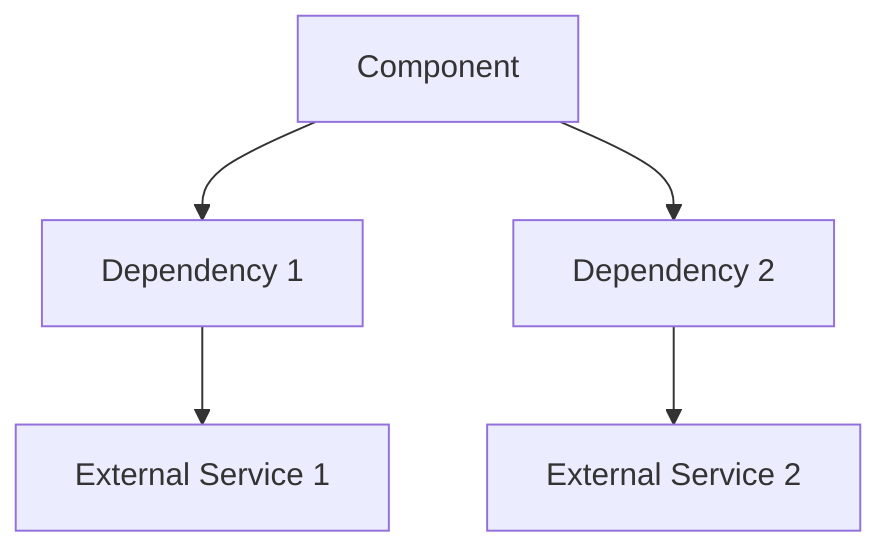
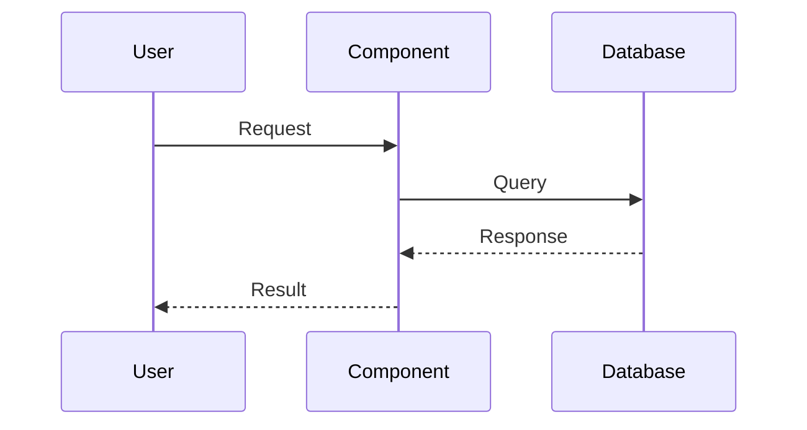

# Architecture Component Name

## Overview
Brief description of the architecture component and its role in the system.

## System Context


## Component Architecture
### High-Level Design
Description of the component's design principles and patterns.

### Key Components
1. Component 1
   - Purpose
   - Responsibilities
   - Interactions
2. Component 2
   - Purpose
   - Responsibilities
   - Interactions

## Data Flow


## State Management
### Data Model
```typescript
interface ComponentState {
  // State definition
}

interface ComponentProps {
  // Props definition
}
```

### State Transitions
Description of state transitions and side effects.

## Dependencies
### Internal Dependencies
- Component dependencies
- Service dependencies
- Library dependencies

### External Dependencies
- Third-party services
- APIs
- Infrastructure dependencies

## Configuration
### Environment Variables
```env
COMPONENT_API_KEY=xxx
COMPONENT_SECRET=xxx
COMPONENT_URL=https://example.com
```

### Feature Flags
- Feature flag 1: Description
- Feature flag 2: Description

## Performance
### Metrics
- Key performance indicators
- Monitoring points
- Alerting thresholds

### Optimization Strategies
- Caching strategy
- Load balancing
- Resource optimization

## Security
### Authentication
Description of authentication mechanisms.

### Authorization
Description of authorization rules and roles.

### Data Protection
- Encryption methods
- Data handling
- Privacy considerations

## Deployment
### Requirements
- Infrastructure requirements
- Service dependencies
- Resource requirements

### Deployment Process
1. Step 1
2. Step 2
3. Step 3

## Testing Strategy
### Unit Testing
Description of unit testing approach.

### Integration Testing
Description of integration testing approach.

### Performance Testing
Description of performance testing methodology.

## Monitoring
### Logging
- Log levels
- Log formats
- Log storage

### Metrics
- Business metrics
- Technical metrics
- SLAs/SLOs

### Alerting
- Alert conditions
- Alert channels
- Response procedures

## Disaster Recovery
### Backup Strategy
Description of backup procedures.

### Recovery Procedures
Steps for disaster recovery.

## Future Considerations
- Planned improvements
- Scalability considerations
- Technical debt

## Related Documentation
- Link to API docs
- Link to feature docs
- Link to deployment docs
